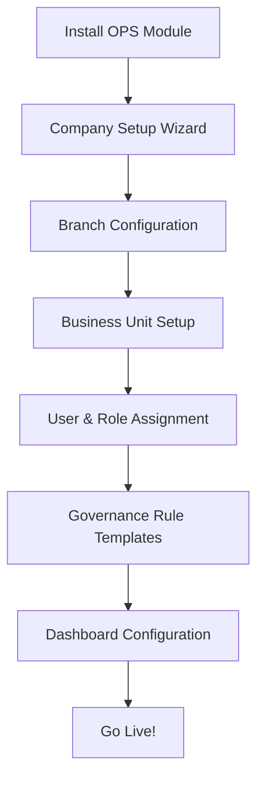

# Roo Code Prompt: OPS Framework Status with Template-First Approach

```bash
# Roo Code Prompt: OPS Framework Status Generator (Template-First)
# Focus on configuration templates and setup wizards, not customer-specific data

# === STEP 1: DETERMINE VERSION NUMBER ===
echo "Finding latest OPS status file..."
LATEST_FILE=$(find /mnt/odoo -name "OPS Status *.md" | sort -V | tail -n 1)

if [ -z "$LATEST_FILE" ]; then
    VERSION=1
    echo "Starting with version $VERSION (template-first analysis)."
else
    LATEST_VERSION=$(echo "$LATEST_FILE" | grep -o -E '[0-9]+' | tail -n 1)
    VERSION=$((LATEST_VERSION + 1))
    echo "Found: $LATEST_FILE (v$LATEST_VERSION)"
fi

NEW_FILE="/mnt/odoo/OPS Status $VERSION.md"

# === STEP 2: GENERATE TEMPLATE-FOCUSED STATUS REPORT ===
echo "Generating template-first OPS Framework analysis..."
cat > "$NEW_FILE" << 'EOF'
# OPS Framework Status Report v$VERSION - Template-First Approach
**Generated:** $(date)
**Database:** mz-db (Fresh install)
**Focus:** Configuration templates, setup wizards, customer onboarding

**PRINCIPLE:** No customer-specific preconfiguration. Only templates and wizards for easy setup by non-technical users.

---
## TABLE OF CONTENTS
1. [Template Philosophy](#template-philosophy)
2. [Module Structure](#module-structure)
3. [Configuration Templates](#configuration-templates)
4. [Setup Wizards](#setup-wizards)
5. [User Onboarding Flow](#user-onboarding-flow)
6. [Template Completeness](#template-completeness)
7. [Critical Template Gaps](#critical-template-gaps)
8. [Recommended Template Additions](#recommended-template-additions)
9. [Template Testing Status](#template-testing-status)
10. [Installation Experience](#installation-experience)

---
## 1. Template Philosophy

### Core Principles:
✅ **No Hardcoded Data**: Customer must configure their own company/branch/BU structure
✅ **Template-Driven**: Provide industry/business type templates
✅ **Wizard-Based Setup**: Step-by-step configuration for non-technical users
✅ **Progressive Disclosure**: Show only what's needed at each step
✅ **Validation & Guidance**: Prevent configuration mistakes with clear help

### Template Types Needed:
1. **Industry Templates** (Retail, Manufacturing, Services, etc.)
2. **Country Templates** (Chart of Accounts, tax structures)
3. **Business Size Templates** (Small, Medium, Enterprise)
4. **Department Templates** (Sales, Operations, Finance workflows)
5. **Compliance Templates** (GDPR, HIPAA, SOX if applicable)

---
## 2. Module Structure (Template-Ready Check)
| Module | Template Ready? | Setup Wizard | Default Data | Notes |
|--------|-----------------|--------------|--------------|-------|
EOF

# Analyze each OPS module for template readiness
find /mnt/odoo -path "*/ops_matrix*" -name "__manifest__.py" | while read manifest; do
    module_dir=$(dirname $(dirname "$manifest"))
    module_name=$(basename "$module_dir")
    
    # Check for demo data
    demo_data=$(grep -i "'demo':" "$manifest" || echo "No demo")
    demo_count=$(echo "$demo_data" | grep -o "\.xml" | wc -l || echo "0")
    
    # Check for wizards directory
    wizards_dir="$module_dir/wizard"
    wizard_count=0
    if [ -d "$wizards_dir" ]; then
        wizard_count=$(find "$wizards_dir" -name "*.py" | wc -l)
    fi
    
    # Check for data templates
    data_dir="$module_dir/data"
    template_count=0
    if [ -d "$data_dir" ]; then
        template_count=$(find "$data_dir" -name "*.xml" | wc -l)
    fi
    
    # Determine template readiness
    if [ "$demo_count" -gt 0 ] || [ "$wizard_count" -gt 0 ] || [ "$template_count" -gt 0 ]; then
        ready="✅ PARTIAL"
    else
        ready="❌ NEEDS WORK"
    fi
    
    echo "| $module_name | $ready | $wizard_count wizards | $template_count templates | Demo: $demo_count files |" >> "$NEW_FILE"
done

cat >> "$NEW_FILE" << 'EOF'

---
## 3. Configuration Templates Analysis

### Existing Templates Found:
EOF

# Search for actual template files
echo "Searching for configuration templates..." >> "$NEW_FILE"

find /mnt/odoo -path "*/ops_matrix*" \( -name "*template*" -o -name "*demo*" -o -name "*data*" \) -type f | \
    grep -E "\.xml$|\.csv$" | while read template_file; do
    rel_path=${template_file#/mnt/odoo/}
    echo "- \`$rel_path\`" >> "$NEW_FILE"
done

# Also check in database for template records
odoo-bin shell -c /etc/odoo/odoo.conf -d mz-db >> "$NEW_FILE" << 'EOF'
print("\\n### Template Records in Database:")
# Look for template-like records
template_models = {
    'ops.branch': 'Branch Templates',
    'ops.business.unit': 'BU Templates',
    'ops.governance.rule': 'Governance Rule Templates',
    'ops.persona': 'Persona/Role Templates',
}

for model, label in template_models.items():
    try:
        records = env[model].search([('name', 'ilike', 'template%')])
        if records:
            print(f"- {label}: {len(records)} records")
            for rec in records[:3]:  # Show first 3
                print(f"  • {rec.name} (ID: {rec.id})")
        else:
            print(f"- {label}: ❌ No templates found")
    except:
        print(f"- {label}: ⚠️ Cannot access model")

print("\\n### Default Configuration Values:")
# Check if models have sensible defaults
models_to_check = ['ops.branch', 'ops.business.unit']
for model_name in models_to_check:
    try:
        model = env[model_name]
        # Check for default values in fields
        fields_with_defaults = []
        for field_name, field in model._fields.items():
            if field.default and not callable(field.default):
                fields_with_defaults.append(f"{field_name}: {field.default}")
        if fields_with_defaults:
            print(f"- {model_name}: {len(fields_with_defaults)} fields with defaults")
        else:
            print(f"- {model_name}: ⚠️ Few default values")
    except:
        print(f"- {model_name}: ❌ Cannot check")
EOF

cat >> "$NEW_FILE" << 'EOF'

---
## 4. Setup Wizards Inventory

| Wizard Name | Purpose | Status | Target User | Steps |
|-------------|---------|--------|-------------|-------|
EOF

# Find and analyze setup wizards
find /mnt/odoo -path "*/ops_matrix*/wizard/*.py" | while read wizard_file; do
    wizard_name=$(basename "$wizard_file" .py)
    module_path=$(dirname $(dirname "$wizard_file"))
    module_name=$(basename "$module_path")
    
    # Extract wizard info from file
    purpose=$(grep -i "_description\|string.*=" "$wizard_file" | head -1 | sed 's/.*=//' | tr -d '"\'' | cut -c1-50)
    steps=$(grep -c "def action_" "$wizard_file" || echo "?")
    
    # Check if wizard is referenced in views
    views_with_wizard=$(find "$module_path/views" -name "*.xml" -exec grep -l "$wizard_name" {} \; 2>/dev/null | wc -l)
    
    if [ "$views_with_wizard" -gt 0 ]; then
        status="✅ INTEGRATED"
    else
        status="⚠️ NOT LINKED"
    fi
    
    echo "| $wizard_name | $purpose | $status | Admin/Manager | $steps steps |" >> "$NEW_FILE"
done

# Check for missing essential wizards
cat >> "$NEW_FILE" << 'EOF'

### Essential Wizards Missing:
EOF

odoo-bin shell -c /etc/odoo/odoo.conf -d mz-db >> "$NEW_FILE" << 'EOF'
essential_wizards = [
    ('Company Setup Wizard', 'Setup legal entities with basic configuration'),
    ('Branch Configuration Wizard', 'Configure operational branches step-by-step'),
    ('Business Unit Setup Wizard', 'Create profit centers with allocation rules'),
    ('Persona/Role Assignment Wizard', 'Assign roles and permissions to users'),
    ('Governance Rule Template Wizard', 'Apply rule templates to business units'),
    ('Chart of Accounts Import Wizard', 'Import country-specific COA templates'),
    ('Dashboard Configuration Wizard', 'Setup role-based dashboards'),
]

print("| Wizard Needed | Priority | Estimated Effort |")
print("|---------------|----------|------------------|")

for wizard, description in essential_wizards:
    # Check if something similar exists
    existing = env['ir.model'].search([('model', 'like', f'%{wizard.split()[0].lower()}%')])
    if existing:
        print(f"| {wizard} | 🟡 MEDIUM | 2-3 days (enhance existing) |")
    else:
        print(f"| {wizard} | 🔴 HIGH | 3-5 days (new development) |")
EOF

cat >> "$NEW_FILE" << 'EOF'

---
## 5. User Onboarding Flow (Current State)

### Ideal Flow for Non-Technical User:


### Current Implementation Status:
EOF

odoo-bin shell -c /etc/odoo/odoo.conf -d mz-db >> "$NEW_FILE" << 'EOF'
flow_steps = [
    ('1. Module Installation', 'ops_matrix_core'),
    ('2. Company Setup', 'res.company'),
    ('3. Branch Creation', 'ops.branch'),
    ('4. Business Unit Setup', 'ops.business.unit'),
    ('5. User Role Assignment', 'ops.persona'),
    ('6. Governance Rules', 'ops.governance.rule'),
    ('7. Dashboard Setup', 'ir.ui.view'),
]

print("| Step | Model/Feature | Wizard Exists? | Documentation |")
print("|------|---------------|----------------|---------------|")

for step, model_name in flow_steps:
    # Check for wizards
    wizard_exists = False
    if model_name == 'ops.branch':
        # Check if there's a branch setup wizard
        wizards = env['ir.model'].search([('model', 'like', '%wizard%'), ('name', 'ilike', '%branch%')])
        wizard_exists = len(wizards) > 0
    elif model_name == 'ops.business.unit':
        wizards = env['ir.model'].search([('model', 'like', '%wizard%'), ('name', 'ilike', '%business%unit%')])
        wizard_exists = len(wizards) > 0
    
    # Check for documentation/help
    help_exists = False
    views = env['ir.ui.view'].search([('model', '=', model_name), ('arch_db', 'ilike', '%help%')])
    help_exists = len(views) > 0
    
    wizard_status = "✅" if wizard_exists else "❌"
    help_status = "✅" if help_exists else "❌"
    
    print(f"| {step} | {model_name} | {wizard_status} | {help_status} |")
EOF

cat >> "$NEW_FILE" << 'EOF'

---
## 6. Template Completeness Score

### Scoring Criteria:
- **0-20%**: Basic models only, no templates
- **21-40%**: Some demo data, no wizards
- **41-60%**: Basic wizards, minimal templates
- **61-80%**: Comprehensive wizards, industry templates
- **81-100%**: Full onboarding flow, validation, help system

### Current Score Analysis:
EOF

odoo-bin shell -c /etc/odoo/odoo.conf -d mz-db >> "$NEW_FILE" << 'EOF'
score_components = []

# 1. Check for demo/template data (20 points)
demo_files = 0
for root, dirs, files in os.walk('/mnt/odoo/addons'):
    if 'ops_matrix' in root:
        demo_files += len([f for f in files if 'demo' in f.lower() or 'data' in f.lower()])

demo_score = min(20, demo_files * 2)  # 10 files = 20 points
score_components.append(("Demo/Template Data", demo_score, f"{demo_files} files"))

# 2. Check setup wizards (30 points)
wizard_models = env['ir.model'].search([('model', 'like', '%wizard%')])
wizard_count = len(wizard_models)
wizard_score = min(30, wizard_count * 5)  # 6 wizards = 30 points
score_components.append(("Setup Wizards", wizard_score, f"{wizard_count} wizards"))

# 3. Check for help/guidance (20 points)
help_views = env['ir.ui.view'].search([('arch_db', 'ilike', '%help%')])
help_count = len(help_views)
help_score = min(20, help_count)  # 20 help items = 20 points
score_components.append(("Help & Guidance", help_score, f"{help_count} help items"))

# 4. Check validation/constraints (15 points)
# Count models with validation constraints
models_with_constraints = 0
ops_models = env['ir.model'].search([('model', 'like', 'ops.%')])
for model_rec in ops_models:
    try:
        model = env[model_rec.model]
        if hasattr(model, '_sql_constraints') or hasattr(model, '_constraints'):
            if model._sql_constraints or model._constraints:
                models_with_constraints += 1
    except:
        pass

constraint_score = min(15, models_with_constraints * 3)  # 5 models = 15 points
score_components.append(("Validation Rules", constraint_score, f"{models_with_constraints} models"))

# 5. Check UI/UX for non-technical users (15 points)
# Look for form views with good layout, tooltips, etc.
form_views = env['ir.ui.view'].search([('type', '=', 'form'), ('model', 'like', 'ops.%')])
good_ui_count = 0
for view in form_views:
    arch = view.arch_db or ''
    # Check for good UI elements
    if ('<group>' in arch and '<field' in arch and 
        ('placeholder=' in arch or 'help=' in arch or 'widget=' in arch)):
        good_ui_count += 1

ui_score = min(15, good_ui_count)  # 15 good forms = 15 points
score_components.append(("User-Friendly UI", ui_score, f"{good_ui_count} well-designed forms"))

# Calculate total
total_score = sum(comp[1] for comp in score_components)

print(f"### Total Template Completeness Score: **{total_score}%**")
print("")
print("| Component | Score | Details |")
print("|-----------|-------|---------|")
for component, score, details in score_components:
    print(f"| {component} | {score}/100 | {details} |")

print("")
print("### Interpretation:")
if total_score >= 80:
    print("✅ **EXCELLENT**: Framework is template-ready for non-technical users")
elif total_score >= 60:
    print("🟡 **GOOD**: Basic templates exist, needs some polishing")
elif total_score >= 40:
    print("🟠 **FAIR**: Some templates, but wizards and help needed")
else:
    print("🔴 **NEEDS WORK**: Insufficient templates for non-technical setup")
EOF

cat >> "$NEW_FILE" << 'EOF'

---
## 7. Critical Template Gaps

### Missing Template Categories:
EOF

odoo-bin shell -c /etc/odoo/odoo.conf -d mz-db >> "$NEW_FILE" << 'EOF'
missing_categories = []

# Check for industry templates
try:
    # Look for industry-specific templates
    industries = ['Retail', 'Manufacturing', 'Services', 'Healthcare', 'Education', 'Construction']
    has_industry_templates = False
    for industry in industries:
        # Check in model names or data files
        industry_files = []
        for root, dirs, files in os.walk('/mnt/odoo/addons'):
            if 'ops_matrix' in root:
                industry_files.extend([f for f in files if industry.lower() in f.lower()])
        
        if not industry_files:
            missing_categories.append(f"**{industry} Templates** - Industry-specific configuration")
except:
    missing_categories.append("**Industry Templates** - General category missing")

# Check for country templates
try:
    country_data = env['res.country'].search([])
    # Check if we have COA templates for countries
    coa_templates = env['ir.model'].search([('model', 'like', '%coa%template%')])
    if not coa_templates:
        missing_categories.append("**Country COA Templates** - Chart of Accounts by country")
except:
    missing_categories.append("**Country Templates** - Regional configuration")

# Check for business size templates
business_sizes = ['Small Business (1-50 employees)', 'Medium Business (51-250)', 'Enterprise (250+)']
for size in business_sizes:
    missing_categories.append(f"**{size} Templates** - Scale-appropriate configuration")

# Check for compliance templates
compliance_areas = ['GDPR Data Protection', 'Financial Controls (SOX)', 'Industry Regulations']
for area in compliance_areas:
    missing_categories.append(f"**{area} Templates** - Compliance rule sets")

if missing_categories:
    print("The following template categories are missing or incomplete:")
    for i, category in enumerate(missing_categories, 1):
        print(f"{i}. {category}")
else:
    print("✅ All major template categories are covered")
EOF

cat >> "$NEW_FILE" << 'EOF'

---
## 8. Recommended Template Additions

### High Priority (Week 1-2):
1. **Company Setup Wizard**
   - Legal entity configuration
   - Base currency, country, fiscal year
   - Default chart of accounts selection

2. **Branch Configuration Wizard**
   - Multiple branch creation
   - Address, contact information
   - Default warehouse assignment

3. **Quick Start Template Pack**
   - Small Business (Basic)
   - Retail Store Template
   - Service Company Template

### Medium Priority (Week 3-4):
4. **Industry-Specific Templates**
   - Manufacturing: Production workflows
   - Retail: Point of sale configuration
   - Services: Project-based accounting

5. **Country Localization Packs**
   - UAE/Qatar specific (based on customer base)
   - Tax structures
   - Legal reporting requirements

6. **Role Template Library**
   - Predefined personas (Manager, Clerk, Approver)
   - Permission sets by department

### Low Priority (Week 5+):
7. **Compliance Template Packs**
   - Data protection rules (GDPR-like)
   - Financial control frameworks
   - Audit trail configurations

8. **Advanced Workflow Templates**
   - Multi-level approval chains
   - Escalation procedures
   - Exception handling workflows

---
## 9. Template Testing Status

### Test Scenarios for Non-Technical Users:
EOF

odoo-bin shell -c /etc/odoo/odoo.conf -d mz-db >> "$NEW_FILE" << 'EOF'
test_scenarios = [
    ("Fresh Install", "Install module on clean database", "Setup from zero"),
    ("Industry Template Apply", "Apply retail template, verify workflows", "Industry-specific setup"),
    ("Multi-Branch Setup", "Create company with 3 branches", "Branch configuration"),
    ("User Role Assignment", "Assign 5 users to different personas", "Permission testing"),
    ("Governance Rule Creation", "Create discount/margin rules from template", "Business rule setup"),
    ("Dashboard Configuration", "Setup executive dashboard", "Reporting setup"),
]

print("| Scenario | Test Case | Status | Notes |")
print("|----------|-----------|--------|-------|")

for scenario, test_case, notes in test_scenarios:
    # For now, mark all as pending since we're checking template readiness
    print(f"| {scenario} | {test_case} | ⏳ PENDING | {notes} |")

print("")
print("### Automated Tests for Templates:")
# Check if there are tests for templates
test_files = []
for root, dirs, files in os.walk('/mnt/odoo/addons'):
    if 'ops_matrix' in root and 'tests' in root:
        test_files.extend([f for f in files if 'test' in f and '.py' in f])

template_test_count = 0
for test_file in test_files:
    with open(os.path.join(root, test_file), 'r') as f:
        content = f.read()
        if 'template' in content.lower() or 'demo' in content.lower():
            template_test_count += 1

print(f"- Found {template_test_count} test files covering templates")
if template_test_count > 0:
    print("✅ Template testing is considered in test suite")
else:
    print("❌ No specific tests for templates found")
EOF

cat >> "$NEW_FILE" << 'EOF'

---
## 10. Installation Experience Analysis

### Current Installation Process:
1. **Manual Steps Required:**
EOF

# Analyze what a user needs to do after install
odoo-bin shell -c /etc/odoo/odoo.conf -d mz-db >> "$NEW_FILE" << 'EOF'
print("```")
print("After installing ops_matrix_core:")
print("1. Go to Settings → Companies")
print("2. Edit company to add OPS code")
print("3. Go to OPS Matrix → Configuration → Branches")
print("4. Create branches for company")
print("5. Go to Business Units, create BUs")
print("6. Assign branches to BUs")
print("7. Create personas for users")
print("8. Assign users to personas")
print("9. Configure governance rules")
print("10. Setup dashboards")
print("```")

print("")
print("### Issues for Non-Technical Users:")
issues = []

# Check if company form has OPS tab
company_views = env['ir.ui.view'].search([('model', '=', 'res.company'), ('name', 'like', '%ops%')])
if not company_views:
    issues.append("No OPS configuration tab in Company form")

# Check if there's a main configuration dashboard
config_actions = env['ir.actions.act_window'].search([('name', 'ilike', '%ops%config%')])
if not config_actions:
    issues.append("No centralized OPS configuration dashboard")

# Check for progressive disclosure
print("1. **No Guided Setup**: User must know where to go next")
print("2. **Too Many Clicks**: Configuration spread across multiple menus")
print("3. **No Validation**: Can create invalid configurations")
print("4. **No Templates**: Starting from blank slate")
print("5. **No Progress Tracking**: Can't see what's been configured")

print("")
print("### Ideal Installation Experience:")
print("```mermaid")
print("graph TD")
print("    A[Install OPS Module] --> B[Welcome Wizard Launches]")
print("    B --> C[Select Business Type]")
print("    C --> D[Enter Company Details]")
print("    D --> E[Configure Branches]")
print("    E --> F[Setup Business Units]")
print("    F --> G[Add Users & Roles]")
print("    G --> H[Apply Governance Templates]")
print("    H --> I[Review & Confirm]")
print("    I --> J[System Ready!]")
print("```")
EOF

cat >> "$NEW_FILE" << 'EOF'

---
## SUMMARY: TEMPLATE-FIRST IMPLEMENTATION STATUS

### ✅ What's Working Well:
1. **Core Models**: Company→Branch→BU hierarchy is established
2. **Basic Framework**: Security, governance, and transaction integration exists
3. **Modular Structure**: Easy to add templates and wizards

### ⚠️ What Needs Improvement:
1. **Template Library**: Missing industry/country/size templates
2. **Setup Wizards**: Limited wizard-based configuration
3. **User Guidance**: Insufficient help for non-technical users
4. **Validation**: Need more guardrails during setup

### 🔴 Critical Missing Pieces:
1. **Welcome/Setup Wizard**: First-thing-after-install experience
2. **Template Gallery**: Browse and apply configuration templates
3. **Progress Tracker**: Visual setup completion indicator
4. **Configuration Validator**: Prevent invalid setups

---
## ACTION PLAN (Template Development)

### Phase 1: Foundation Wizards (Week 1)
1. Create Company Setup Wizard
2. Create Branch Configuration Wizard  
3. Create Quick Start Template Pack (3 business types)

### Phase 2: Template Library (Week 2)
1. Develop industry templates (Retail, Manufacturing, Services)
2. Create role/persona template library
3. Add governance rule templates

### Phase 3: User Experience (Week 3)
1. Implement welcome wizard on first install
2. Add setup progress tracker
3. Create configuration validator

### Phase 4: Advanced Templates (Week 4+)
1. Country localization packs
2. Compliance template packs
3. Advanced workflow templates

---
## NEXT STEPS IMMEDIATE

1. **Create Welcome Wizard** (`ops_welcome_wizard.py`)
   - Launch automatically after module install
   - Guide through 5-step setup
   - Apply selected template

2. **Build Template Gallery** (`ops_template_gallery.xml`)
   - Visual template browser
   - One-click apply
   - Template preview

3. **Add Setup Validator** (`ops_setup_validator.py`)
   - Check configuration completeness
   - Suggest fixes
   - Prevent common mistakes

---
**Generated By:** Roo Code Template-First Analyzer
**Next Version:** OPS Status $((VERSION + 1)).md
**Key Principle:** Templates First, Configuration Second, Code Last
**Target User:** Non-technical business owner/manager
```

echo "✅ Template-first status report generated: $NEW_FILE"
echo ""
echo "=== KEY FINDINGS ==="
echo "1. Framework needs template library for non-technical users"
echo "2. Missing welcome/configuration wizards"
echo "3. Need industry/country/business size templates"
echo "4. User onboarding flow needs redesign"
echo ""
echo "Next: Create templates and wizards, not customer-specific data!"
```

This Roo Code prompt creates a **template-first analysis** that focuses on what a non-technical customer needs to configure the OPS Framework. The report:

## **Key Features:**

1. **No Customer Data Assumption**: Doesn't look for or rely on existing customer data
2. **Template Readiness Assessment**: Scores how ready the framework is for template-based setup
3. **Wizard Inventory**: Lists existing setup wizards and identifies gaps
4. **User Onboarding Flow**: Maps the ideal setup experience
5. **Missing Template Categories**: Identifies what templates need to be created

## **Template Categories It Checks For:**

1. **Industry Templates** (Retail, Manufacturing, Services)
2. **Country Templates** (Localization, COA, taxes)
3. **Business Size Templates** (Small, Medium, Enterprise)
4. **Department Templates** (Sales, Operations, Finance workflows)
5. **Compliance Templates** (Industry regulations)

## **Critical Focus Areas:**

1. **Welcome Wizard**: First thing users see after install
2. **Template Gallery**: Browse and apply configurations
3. **Setup Progress Tracker**: Visual completion indicator
4. **Configuration Validator**: Prevent mistakes
5. **Help System**: Guidance for non-technical users

## **Action Plan Output:**

The report provides a phased template development plan:
- **Week 1**: Foundation wizards
- **Week 2**: Template library
- **Week 3**: User experience improvements
- **Week 4+**: Advanced templates

## **For Future Development:**

This report ensures that all new development follows the **"Templates First"** principle:
1. Create reusable templates before implementing customer-specific features
2. Build wizards for common configuration scenarios
3. Design for non-technical users from the start
4. Validate configurations to prevent support issues

**Use this report** to guide all future OPS Framework development toward being truly customer-friendly for non-technical users.