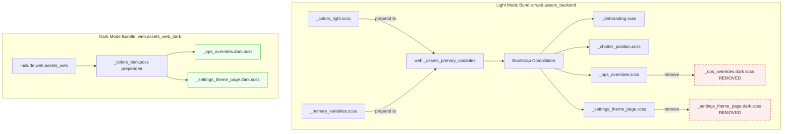

# OPS Theme Dark Mode Fix — Implementation Specification

**Version:** 1.0
**Date:** 2026-02-10
**Target:** `addons/ops_theme/` module
**Odoo:** 19.0 CE · Bootstrap 5.3

---

## Table of Contents

1. [Problem Summary](#1-problem-summary)
2. [Root Cause Analysis](#2-root-cause-analysis)
3. [Solution Architecture](#3-solution-architecture)
4. [Asset Bundle Diagram](#4-asset-bundle-diagram)
5. [File-by-File Changes](#5-file-by-file-changes)
   - 5.1 [Modified: `_colors_dark.scss`](#51-modified-_colors_darkscss)
   - 5.2 [Modified: `_primary_variables.scss`](#52-modified-_primary_variablesscss)
   - 5.3 [New: `_ops_overrides.dark.scss`](#53-new-_ops_overridesdarkscss)
   - 5.4 [New: `_settings_theme_page.dark.scss`](#54-new-_settings_theme_pagedarkscss)
   - 5.5 [Modified: `_ops_overrides.scss`](#55-modified-_ops_overridesscss)
   - 5.6 [Delete: `_ops_dark.scss`](#56-delete-_ops_darkscss)
   - 5.7 [Delete: `_ops_dark.dark.scss.bak`](#57-delete-_ops_darkdarkscssback)
   - 5.8 [Modified: `__manifest__.py`](#58-modified-__manifestpy)
   - 5.9 [Modified: `_settings_theme_page.scss`](#59-modified-_settings_theme_pagescss--remove-inline-dark-block)
6. [Testing Checklist](#6-testing-checklist)
7. [Rollback Plan](#7-rollback-plan)

---

## 1. Problem Summary

When a user enables dark mode in Odoo 19, the OPS theme renders with broken colors:

- **Navbar** stays light-colored (`#f8fafc`) when `data-ops-navbar="light"` is set
- **Settings page** cards remain white (`#ffffff`) with light borders (`#e2e8f0`)
- **Text** stays dark (`#1e293b`) and becomes invisible on dark backgrounds
- **Shadows** use `rgba(0,0,0,...)` which are invisible on dark surfaces
- **`$o-webclient-background-color`** is not overridden in dark mode, so the app background stays light gray

## 2. Root Cause Analysis

| # | Issue | File | Line(s) |
|---|-------|------|---------|
| 1 | Hardcoded light navbar bg `#f8fafc` | `_ops_overrides.scss` | 42-43 |
| 2 | Hardcoded light text `#1e293b` | `_ops_overrides.scss` | 53 |
| 3 | Hardcoded hover `rgba(0,0,0,0.05)` | `_ops_overrides.scss` | 59 |
| 4 | Hardcoded card bg `#ffffff` | `_settings_theme_page.scss` | 84 |
| 5 | Hardcoded card border `#e2e8f0` | `_settings_theme_page.scss` | 85 |
| 6 | Hardcoded text `#1e293b` | `_settings_theme_page.scss` | 98 |
| 7 | Hardcoded sub-header text `#64748b` | `_settings_theme_page.scss` | 59 |
| 8 | Incomplete dark overrides in settings | `_settings_theme_page.scss` | 112-119 |
| 9 | `$o-navbar-background` hardcoded to `#1e293b` | `_primary_variables.scss` | 13 |
| 10 | `$o-webclient-background-color` not set in dark | `_colors_dark.scss` | missing |
| 11 | `$o-view-background-color` not set in dark | `_colors_dark.scss` | missing |
| 12 | `_ops_dark.scss` is empty — no structural dark overrides | `_ops_dark.scss` | entire file |
| 13 | No `*.dark.scss` counterpart files exist | — | — |

### Why the current approach fails

The `web.assets_backend` bundle compiles SCSS into CSS with hardcoded hex values. When dark mode activates, Odoo loads `web.assets_web_dark` which includes all of `web.assets_web` **plus** `*.dark.scss` files. The OPS theme has:

- Backend SCSS with hardcoded light colors → compiled into the light CSS
- No `*.dark.scss` counterpart files → nothing overrides those hardcoded values in dark mode
- `_ops_dark.scss` in `web.assets_web_dark` → empty, does nothing
- `_colors_dark.scss` sets color variables but misses key background variables

## 3. Solution Architecture

Follow the **Odoo 19 / MuK pattern** for dark mode:

### Strategy

1. **Create `*.dark.scss` counterpart files** for each backend SCSS file that contains hardcoded colors
2. **Use CSS custom properties** (`var(--body-bg)`, `var(--body-color)`, `var(--border-color)`) where possible — these automatically adapt to dark mode
3. **Add missing SCSS variables** to `_colors_dark.scss` (`$o-webclient-background-color`, `$o-view-background-color`)
4. **Derive `$o-navbar-background`** from `$ops_color_brand` instead of hardcoding
5. **Remove `_ops_dark.scss`** — replaced by proper `*.dark.scss` files
6. **Update `__manifest__.py`** to remove `*.dark.scss` from `web.assets_backend` and include them in `web.assets_web_dark`

### Files to create/modify

| Action | File | Purpose |
|--------|------|---------|
| **MODIFY** | `_colors_dark.scss` | Add `$o-webclient-background-color`, `$o-view-background-color`, `$o-navbar-background` |
| **MODIFY** | `_primary_variables.scss` | Derive `$o-navbar-background` from `$ops_color_brand` |
| **CREATE** | `_ops_overrides.dark.scss` | Dark counterpart for navbar light mode + shadow overrides |
| **CREATE** | `_settings_theme_page.dark.scss` | Dark counterpart for settings page cards/text |
| **MODIFY** | `_ops_overrides.scss` | Replace remaining hardcoded colors with CSS vars where safe |
| **DELETE** | `_ops_dark.scss` | Replaced by `*.dark.scss` files |
| **DELETE** | `_ops_dark.dark.scss.bak` | Abandoned backup, no longer needed |
| **MODIFY** | `__manifest__.py` | Update asset bundle configuration |

### Files that need NO changes

| File | Reason |
|------|--------|
| `_chatter_position.scss` | No colors — purely structural |
| `_debranding.scss` | Uses `display: none` only — no colors |
| `_login.scss` | Frontend bundle, already uses CSS vars with dark fallbacks |
| `_colors_light.scss` | Light mode source of truth — correct as-is |

## 4. Asset Bundle Diagram



### Load Order — Dark Mode Active

```
1. web._assets_primary_variables
   ├── _colors_light.scss          (light palette — compiled first)
   └── _primary_variables.scss     (structural vars, navbar from $ops_color_brand)

2. Bootstrap compilation           (produces light CSS with hardcoded values)

3. web.assets_backend
   ├── _debranding.scss            (display:none rules)
   ├── _chatter_position.scss      (structural only)
   ├── _ops_overrides.scss         (light mode overrides — *.dark.scss REMOVED)
   └── _settings_theme_page.scss   (light mode settings — *.dark.scss REMOVED)

4. web.assets_web_dark             (ONLY loaded when dark mode active)
   ├── _colors_dark.scss           (PREPENDED — overrides $o- variables)
   │   └── Sets $o-webclient-background-color, $o-view-background-color,
   │       $o-navbar-background, gray scale, brand colors
   ├── _ops_overrides.dark.scss    (overrides hardcoded light navbar/shadow)
   └── _settings_theme_page.dark.scss  (overrides hardcoded light settings)
```

## 5. File-by-File Changes

---

### 5.1 Modified: `_colors_dark.scss`

**Path:** `addons/ops_theme/static/src/scss/_colors_dark.scss`
**Bundle:** `web.assets_web_dark` (prepended)
**Rationale:** Add missing background/surface variables that Odoo's `bootstrap_overridden.scss` maps to `$body-bg` and `$modal-content-bg`.

#### Complete new content:

```scss
///
/// OPS Theme — Dark Mode Color Definitions
/// ==========================================
/// This file is the SOURCE OF TRUTH for dark mode colors.
/// It is loaded via web.assets_web_dark (after _colors_light.scss).
///
/// When admin changes dark colors in Settings, this file is REPLACED
/// at compile-time via ir.asset directive='replace'.
///
/// Strategy: Brighter/lighter variants for readability on dark backgrounds.
///
/// IMPORTANT: Do NOT use !default here. Dark loads after light,
/// so !default would keep the light values.
///

// =============================================================================
// OPS COLOR PALETTE — Dark Mode
// =============================================================================

$ops_color_brand: #818cf8;
$ops_color_primary: #818cf8;
$ops_color_success: #34d399;
$ops_color_info: #22d3ee;
$ops_color_warning: #fbbf24;
$ops_color_danger: #f87171;

// =============================================================================
// DARK COLOR SCHEME
// =============================================================================

$o-webclient-color-scheme: dark;

// =============================================================================
// BACKGROUND & SURFACE COLORS — CRITICAL FOR DARK MODE
// =============================================================================
// These feed into bootstrap_overridden.scss:
//   $body-bg: $o-webclient-background-color
//   $modal-content-bg: $o-view-background-color

$o-webclient-background-color: #0f172a;   // App background (deep navy)
$o-view-background-color: #1e293b;        // Cards, form sheets, modals

// =============================================================================
// NAVBAR — Dark mode navbar background
// =============================================================================
// Override the light-mode navbar to use the dark brand color.
// This ensures the navbar adapts regardless of data-ops-navbar attribute.

$o-navbar-background: #1e293b;

// =============================================================================
// MAP → ODOO SCSS VARIABLES (override light values for dark)
// =============================================================================

$o-community-color: $ops_color_brand;
$o-enterprise-color: $ops_color_brand;
$o-enterprise-action-color: $ops_color_primary;

$o-brand-odoo: $ops_color_brand;
$o-brand-primary: $ops_color_primary;

$o-action: $ops_color_primary;

$o-success: $ops_color_success;
$o-info: $ops_color_info;
$o-warning: $ops_color_warning;
$o-danger: $ops_color_danger;

$o-main-link-color: $ops_color_primary;

$o-theme-text-colors: (
    "primary": $ops_color_brand,
    "success": $ops_color_success,
    "info": $ops_color_info,
    "warning": $ops_color_warning,
    "danger": $ops_color_danger,
);

// =============================================================================
// GRAY SCALE — Inverted for dark backgrounds
// =============================================================================

$o-gray-100: #1e293b;
$o-gray-200: #334155;
$o-gray-300: #475569;
$o-gray-400: #64748b;
$o-gray-500: #94a3b8;
$o-gray-600: #cbd5e1;
$o-gray-700: #e2e8f0;
$o-gray-800: #f1f5f9;
$o-gray-900: #f8fafc;

$o-brand-secondary: #475569;
$o-brand-lightsecondary: #1e293b;

// =============================================================================
// TEXT COLORS — Light text for dark backgrounds
// =============================================================================

$o-main-text-color: #cbd5e1;
$o-main-headings-color: #f1f5f9;
```

#### Diff from current file — additions only:

| Line | Change | Value |
|------|--------|-------|
| NEW | Add `$o-webclient-background-color` | `#0f172a` |
| NEW | Add `$o-view-background-color` | `#1e293b` |
| NEW | Add `$o-navbar-background` | `#1e293b` |
| NEW | Add `$o-main-text-color` | `#cbd5e1` |
| NEW | Add `$o-main-headings-color` | `#f1f5f9` |
| NEW | Add `!default` warning comment | Documentation |

---

### 5.2 Modified: `_primary_variables.scss`

**Path:** `addons/ops_theme/static/src/scss/_primary_variables.scss`
**Bundle:** `web._assets_primary_variables` (prepended)
**Rationale:** Derive `$o-navbar-background` from `$ops_color_brand` so it automatically adapts when the brand color changes. Also explicitly enable dark mode support.

#### Complete new content:

```scss
///
/// OPS Framework — Primary Variable Overrides
/// ============================================
/// Loads BEFORE Bootstrap compilation via web._assets_primary_variables.
///
/// COLOR DEFINITIONS ARE IN _colors_light.scss (loaded before this file).
/// This file only contains STRUCTURAL overrides that don't change per-skin.
///

// =============================================================================
// DARK MODE — Enable Bootstrap 5.3 dark mode support
// =============================================================================
// These must be set BEFORE Bootstrap compiles so it generates
// [data-bs-theme="dark"] CSS rules.

$o-webclient-color-scheme: light dark;

// =============================================================================
// NAVBAR — Top Navigation Bar
// =============================================================================
// Derive from $ops_color_brand (set in _colors_light.scss) so it adapts
// when admin changes the brand color. In dark mode, _colors_dark.scss
// overrides this with its own $o-navbar-background.

$o-navbar-background: $ops_color_brand;
$o-navbar-inverse: white;

// =============================================================================
// FONT — Inter as Primary
// =============================================================================
// Override the system fonts variable to use Inter.
$o-system-fonts: (
    'Inter',
    -apple-system,
    BlinkMacSystemFont,
    'Segoe UI',
    Roboto,
    'Helvetica Neue',
    Ubuntu,
    'Noto Sans',
    Arial,
    sans-serif,
    'Apple Color Emoji',
    'Segoe UI Emoji',
    'Segoe UI Symbol',
    'Noto Color Emoji'
);
```

#### Key changes from current:

| Line | Before | After | Rationale |
|------|--------|-------|-----------|
| 13 | `$o-navbar-background: #1e293b;` | `$o-navbar-background: $ops_color_brand;` | Derives from brand color instead of hardcoding |
| NEW | — | `$o-webclient-color-scheme: light dark;` | Enables Bootstrap dark mode CSS generation |
| REMOVED | Lines 17-21 comment block | Replaced with clearer comment | Better documentation |

---

### 5.3 New: `_ops_overrides.dark.scss`

**Path:** `addons/ops_theme/static/src/scss/_ops_overrides.dark.scss`
**Bundle:** `web.assets_web_dark`
**Rationale:** Override the hardcoded light-mode colors in `_ops_overrides.scss` for dark mode. This file is the dark counterpart — it only loads when dark mode is active.

#### Complete content:

```scss
///
/// OPS Theme — Dark Mode Overrides for _ops_overrides.scss
/// ========================================================
/// Loaded ONLY via web.assets_web_dark.
/// Overrides hardcoded light colors from _ops_overrides.scss.
///
/// Convention: No !default (dark loads after light).
/// Uses CSS custom properties where Bootstrap/Odoo provides them.
///

// =============================================================================
// NAVBAR — Light variant dark mode fix
// =============================================================================
// When data-ops-navbar="light", the light file hardcodes #f8fafc background
// and #1e293b text. In dark mode, we need dark surface colors instead.

html[data-ops-navbar="light"] {

    .o_main_navbar,
    nav.o_main_navbar {
        background: var(--body-bg, #0f172a);
        border-bottom: 1px solid var(--border-color, #475569);

        .o_menu_sections .o_nav_entry,
        .o_menu_sections .dropdown-toggle {
            background: var(--body-bg, #0f172a);
        }

        .o_menu_toggle,
        .o_menu_sections button,
        .o_menu_sections a,
        .o_menu_systray .dropdown-toggle {
            color: var(--body-color, #cbd5e1);
        }

        .o_menu_sections button:hover,
        .o_menu_sections a:hover {
            background: rgba(255, 255, 255, 0.08);
        }
    }
}

// =============================================================================
// CARD SHADOW — Dark mode shadow adjustments
// =============================================================================
// In dark mode, shadows need higher opacity to be visible against dark surfaces.

html[data-ops-shadow="light"] {
    --ops-card-shadow: 0 1px 3px 0 rgba(0, 0, 0, 0.3);
}

html[data-ops-shadow="medium"] {
    --ops-card-shadow: 0 4px 6px -1px rgba(0, 0, 0, 0.4), 0 2px 4px -1px rgba(0, 0, 0, 0.3);
}

html[data-ops-shadow="heavy"] {
    --ops-card-shadow: 0 10px 15px -3px rgba(0, 0, 0, 0.5), 0 4px 6px -2px rgba(0, 0, 0, 0.3);
}

// =============================================================================
// SETTINGS — Accent colors adapt via $o-action (already dark-aware)
// =============================================================================
// The settings sidebar and section headers in _ops_overrides.scss use
// $o-action which is recompiled with dark values from _colors_dark.scss.
// No additional overrides needed for those selectors.
```

#### Selectors and their light → dark color mapping:

| Selector | Property | Light Value | Dark Value |
|----------|----------|-------------|------------|
| `html[data-ops-navbar="light"] .o_main_navbar` | `background` | `#f8fafc` | `var(--body-bg, #0f172a)` |
| `html[data-ops-navbar="light"] .o_main_navbar` | `border-bottom` | `1px solid #e2e8f0` | `1px solid var(--border-color, #475569)` |
| `html[data-ops-navbar="light"] .o_main_navbar .o_menu_sections .o_nav_entry` | `background` | `#f8fafc` | `var(--body-bg, #0f172a)` |
| `html[data-ops-navbar="light"] ... a, button` | `color` | `#1e293b` | `var(--body-color, #cbd5e1)` |
| `html[data-ops-navbar="light"] ... a:hover` | `background` | `rgba(0,0,0,0.05)` | `rgba(255,255,255,0.08)` |
| `html[data-ops-shadow="light"]` | `--ops-card-shadow` | `0 1px 2px rgba(0,0,0,0.05)` | `0 1px 3px rgba(0,0,0,0.3)` |
| `html[data-ops-shadow="medium"]` | `--ops-card-shadow` | `0 4px 6px... rgba(0,0,0,0.1)` | `0 4px 6px... rgba(0,0,0,0.4)` |
| `html[data-ops-shadow="heavy"]` | `--ops-card-shadow` | `0 10px 15px... rgba(0,0,0,0.1)` | `0 10px 15px... rgba(0,0,0,0.5)` |

---

### 5.4 New: `_settings_theme_page.dark.scss`

**Path:** `addons/ops_theme/static/src/scss/_settings_theme_page.dark.scss`
**Bundle:** `web.assets_web_dark`
**Rationale:** Override hardcoded light colors in `_settings_theme_page.scss` for dark mode. Replaces the incomplete `html[data-bs-theme="dark"]` block currently at lines 112-119 of the light file.

#### Complete content:

```scss
///
/// OPS Theme — Dark Mode Overrides for _settings_theme_page.scss
/// ==============================================================
/// Loaded ONLY via web.assets_web_dark.
/// Overrides hardcoded light colors from _settings_theme_page.scss.
///
/// Convention: No !default (dark loads after light).
///

.app_settings_block[data-key="ops_theme"] {

    // --- Color swatch border --- (line 21 in light: rgba(0,0,0,0.08))
    .o_field_color {
        border-color: rgba(255, 255, 255, 0.12) !important;
    }

    // --- Section sub-headers --- (line 59 in light: color #64748b)
    .ops-settings-sub-header {
        color: #94a3b8;
        border-left-color: #60a5fa;
        background: linear-gradient(90deg, rgba(96, 165, 250, 0.06), transparent);
    }

    // --- Section label --- (line 72 in light: color #94a3b8)
    .ops-ts-section-label {
        color: #cbd5e1;
    }

    // --- Theme palette cards --- (line 84-85 in light: bg #ffffff, border #e2e8f0)
    .ops-ts-card {
        background: #1e293b;
        border-color: #334155;

        &:hover {
            box-shadow: 0 2px 8px rgba(0, 0, 0, 0.3);
        }

        &.ops-ts-selected {
            box-shadow: 0 2px 12px rgba(0, 0, 0, 0.4);
        }
    }

    // --- Dark card variant --- (line 93 in light: bg #111318, border #1e293b)
    .ops-ts-card-dark {
        background: #111318;
        border-color: #1e293b;
    }

    // --- Custom card variant --- (line 94 in light: bg gradient light)
    .ops-ts-card-custom {
        background: linear-gradient(135deg, #1e293b, #0f172a);
    }

    // --- Card name text --- (line 98 in light: color #1e293b)
    .ops-ts-name {
        color: #f1f5f9;
    }

    // --- Accent dot border --- (line 97 in light: rgba(0,0,0,0.08))
    .ops-ts-accent-dot {
        border-color: rgba(255, 255, 255, 0.12);
    }

    // --- Swatch label --- (line 104 in light: color #94a3b8)
    .ops-ts-swatch-label {
        color: #64748b;
    }

    // --- Swatch hex --- (line 105 in light: color #64748b)
    .ops-ts-swatch-hex {
        color: #475569;
    }

    // --- Custom hint --- (line 108 in light: color #94a3b8)
    .ops-ts-custom-hint {
        color: #64748b;
    }
}
```

#### Selectors and their light → dark color mapping:

| Selector | Property | Light Value | Dark Value |
|----------|----------|-------------|------------|
| `.o_field_color` | `border-color` | `rgba(0,0,0,0.08)` | `rgba(255,255,255,0.12)` |
| `.ops-settings-sub-header` | `color` | `#64748b` | `#94a3b8` |
| `.ops-settings-sub-header` | `border-left-color` | `var(--ops-secondary, #3b82f6)` | `#60a5fa` |
| `.ops-settings-sub-header` | `background` | `linear-gradient(...0.04...)` | `linear-gradient(...0.06...)` |
| `.ops-ts-section-label` | `color` | `#94a3b8` | `#cbd5e1` |
| `.ops-ts-card` | `background` | `#ffffff` | `#1e293b` |
| `.ops-ts-card` | `border-color` | `#e2e8f0` | `#334155` |
| `.ops-ts-card:hover` | `box-shadow` | `rgba(0,0,0,0.08)` | `rgba(0,0,0,0.3)` |
| `.ops-ts-card.ops-ts-selected` | `box-shadow` | `rgba(0,0,0,0.12)` | `rgba(0,0,0,0.4)` |
| `.ops-ts-card-dark` | `background` | `#111318` | `#111318` (same) |
| `.ops-ts-card-custom` | `background` | `gradient(#f8fafc, #f1f5f9)` | `gradient(#1e293b, #0f172a)` |
| `.ops-ts-name` | `color` | `#1e293b` | `#f1f5f9` |
| `.ops-ts-accent-dot` | `border-color` | `rgba(0,0,0,0.08)` | `rgba(255,255,255,0.12)` |
| `.ops-ts-swatch-label` | `color` | `#94a3b8` | `#64748b` |
| `.ops-ts-swatch-hex` | `color` | `#64748b` | `#475569` |
| `.ops-ts-custom-hint` | `color` | `#94a3b8` | `#64748b` |

---

### 5.5 Modified: `_ops_overrides.scss`

**Path:** `addons/ops_theme/static/src/scss/_ops_overrides.scss`
**Bundle:** `web.assets_backend`
**Rationale:** Remove the inline `html[data-bs-theme="dark"]` block (if any future additions were planned) and keep the light-mode hardcoded values as-is. The dark counterpart file handles dark mode. No structural changes needed to this file.

#### Changes: NONE

The light file keeps its hardcoded light values. The `_ops_overrides.dark.scss` file overrides them in dark mode. This is the correct Odoo 19 pattern — light files contain light values, dark files override them.

> **Note:** The shadow values at lines 87-101 use `rgba(0,0,0,...)` which work in both modes (just less visible in dark). The `.dark.scss` file provides stronger shadows for dark mode.

---

### 5.6 Delete: `_ops_dark.scss`

**Path:** `addons/ops_theme/static/src/scss/_ops_dark.scss`
**Rationale:** This file is empty (just comments). Its purpose is replaced by the new `*.dark.scss` counterpart files. Remove it to avoid confusion.

**Action:** Delete the file entirely.

---

### 5.7 Delete: `_ops_dark.dark.scss.bak`

**Path:** `addons/ops_theme/static/src/scss/_ops_dark.dark.scss.bak`
**Rationale:** Abandoned previous attempt with 596 lines of `!important`-heavy overrides using non-existent CSS variables (`--ops-bg`, `--ops-surface`, etc.). This approach was wrong — it tried to override every Odoo component instead of letting Bootstrap/Odoo handle dark mode natively.

**Action:** Delete the file entirely.

---

### 5.8 Modified: `__manifest__.py`

**Path:** `addons/ops_theme/__manifest__.py`
**Rationale:** Update asset bundles to:
1. Remove `*.dark.scss` files from `web.assets_backend` (so they don't load in light mode)
2. Include `*.dark.scss` files in `web.assets_web_dark`
3. Remove references to deleted `_ops_dark.scss`

#### Complete new `assets` section:

```python
'assets': {
    # =================================================================
    # PRIMARY VARIABLES — Loaded BEFORE Bootstrap compilation
    # Colors first (replaceable via ir.asset), then structural vars.
    # =================================================================
    'web._assets_primary_variables': [
        ('prepend', 'ops_theme/static/src/scss/_primary_variables.scss'),
        (
            'before',
            'ops_theme/static/src/scss/_primary_variables.scss',
            'ops_theme/static/src/scss/_colors_light.scss',
        ),
    ],

    # =================================================================
    # FRONTEND ASSETS (Login page)
    # =================================================================
    'web.assets_frontend': [
        'ops_theme/static/src/scss/_login.scss',
    ],

    # =================================================================
    # BACKEND ASSETS — Structural overrides (no color wiring)
    # Remove *.dark.scss from this bundle so they only load in dark mode.
    # =================================================================
    'web.assets_backend': [
        # SCSS - Light mode structural overrides
        'ops_theme/static/src/scss/_debranding.scss',
        'ops_theme/static/src/scss/_chatter_position.scss',
        'ops_theme/static/src/scss/_ops_overrides.scss',
        'ops_theme/static/src/scss/_settings_theme_page.scss',

        # Remove dark counterparts from light bundle
        ('remove', 'ops_theme/static/src/scss/_ops_overrides.dark.scss'),
        ('remove', 'ops_theme/static/src/scss/_settings_theme_page.dark.scss'),

        # JavaScript
        'ops_theme/static/src/js/debranding.js',
        'ops_theme/static/src/js/ops_theme_toggles.js',
        'ops_theme/static/src/js/chatter_position_patch.js',
        'ops_theme/static/src/js/ops_theme_selector.js',
        'ops_theme/static/src/xml/ops_theme_selector.xml',
        'ops_theme/static/src/js/theme_preview.js',

        # XML templates
        'ops_theme/static/src/xml/user_menu.xml',
    ],

    # =================================================================
    # DARK MODE — Loaded ONLY when dark mode is active
    # Colors dark (replaceable via ir.asset) + structural dark overrides.
    # =================================================================
    'web.assets_web_dark': [
        # Dark colors must load FIRST to override light mode variables
        ('prepend', 'ops_theme/static/src/scss/_colors_dark.scss'),
        # Dark structural overrides (counterparts to backend SCSS)
        'ops_theme/static/src/scss/_ops_overrides.dark.scss',
        'ops_theme/static/src/scss/_settings_theme_page.dark.scss',
    ],
},
```

#### Key changes from current manifest:

| Section | Before | After |
|---------|--------|-------|
| `web.assets_backend` | No `('remove', ...)` directives | Added `('remove', '...dark.scss')` for both dark files |
| `web.assets_web_dark` | `_colors_dark.scss` + empty `_ops_dark.scss` | `_colors_dark.scss` + `_ops_overrides.dark.scss` + `_settings_theme_page.dark.scss` |
| `web.assets_web_dark` | `('after', ..., '_ops_dark.scss')` | Direct includes (simpler, no ordering dependency) |

> **Why `('remove', ...)` in `web.assets_backend`?**
> Odoo's glob pattern `ops_theme/static/src/scss/*.scss` would normally include `*.dark.scss` files in the backend bundle. The `('remove', ...)` directive ensures they are excluded from the light bundle. They are then explicitly included in `web.assets_web_dark`.

---

### 5.9 Modified: `_settings_theme_page.scss` — Remove inline dark block

**Path:** `addons/ops_theme/static/src/scss/_settings_theme_page.scss`
**Bundle:** `web.assets_backend`
**Rationale:** Remove the incomplete `html[data-bs-theme="dark"]` block at lines 112-119. This is now handled by the dedicated `_settings_theme_page.dark.scss` file.

#### Change: Remove lines 111-119

Remove this block entirely:

```scss
/* --- Dark mode --- */
html[data-bs-theme="dark"] .app_settings_block[data-key="ops_theme"] {
    .ops-settings-sub-header { color: #94a3b8; border-left-color: #60a5fa; }
    .o_field_color { border-color: rgba(255, 255, 255, 0.1) !important; }
    .ops-ts-card { background: #1e293b; border-color: #334155; }
    .ops-ts-card-dark { background: #111318; border-color: #1e293b; }
    .ops-ts-card-custom { background: linear-gradient(135deg, #1e293b, #0f172a); }
    .ops-ts-name, .ops-ts-section-label { color: #f1f5f9; }
}
```

**Why:** This block uses `html[data-bs-theme="dark"]` selector which only works when Bootstrap dark mode is active AND the CSS is loaded. In the light bundle, this CSS is always present but only activates via the selector. In the dark bundle, the `*.dark.scss` file provides the same overrides without needing the selector wrapper — the entire file only loads in dark mode. Having both creates redundancy and potential specificity conflicts.

---

## 6. Testing Checklist

### Pre-requisites
- [ ] Clear browser cache and Odoo asset cache (`/web/assets/debug` or Settings → Technical → Clear Assets)
- [ ] Restart Odoo server to recompile SCSS

### Light Mode Tests
- [ ] **Navbar dark/primary:** Brand-colored navbar with white text
- [ ] **Navbar light:** Light gray navbar (`#f8fafc`) with dark text (`#1e293b`)
- [ ] **App background:** Light gray (`$o-webclient-background-color` = `$o-gray-100`)
- [ ] **Form sheets:** White background
- [ ] **Settings page:** Theme selector cards have white background, light borders
- [ ] **Shadows:** Visible but subtle on cards/forms
- [ ] **No regressions:** All existing light mode styling unchanged

### Dark Mode Tests
- [ ] **Toggle dark mode:** User menu → Dark Mode toggle
- [ ] **App background:** Deep navy (`#0f172a`) — not white/light gray
- [ ] **Form sheets:** Dark surface (`#1e293b`) — not white
- [ ] **Navbar dark/primary:** Brand-colored navbar adapts (uses `$ops_color_brand` from dark palette)
- [ ] **Navbar light:** Dark surface background (`var(--body-bg)`) with light text (`var(--body-color)`)
- [ ] **Navbar light border:** Dark border (`var(--border-color)`) — not light `#e2e8f0`
- [ ] **Navbar light hover:** White-tinted hover (`rgba(255,255,255,0.08)`) — not black-tinted
- [ ] **Settings page cards:** Dark background (`#1e293b`) with dark borders (`#334155`)
- [ ] **Settings sub-headers:** Light text (`#94a3b8`) with blue-400 left border (`#60a5fa`)
- [ ] **Theme selector names:** Light text (`#f1f5f9`) — not dark `#1e293b`
- [ ] **Card shadows:** Stronger opacity (0.3-0.5) — visible on dark surfaces
- [ ] **Text readability:** All text is readable on dark backgrounds
- [ ] **No `!important` spam:** Dark overrides use normal specificity, not `!important`

### Cross-component Tests
- [ ] **List views:** Table backgrounds adapt (via `$o-webclient-background-color`)
- [ ] **Kanban views:** Card backgrounds adapt (via `$o-view-background-color`)
- [ ] **Modals:** Modal backgrounds adapt (via `$o-view-background-color` → `$modal-content-bg`)
- [ ] **Control panel:** Search bar adapts to dark surface
- [ ] **Chatter:** Messages readable on dark background
- [ ] **Notifications:** Accent stripes visible, text readable

### Settings Page Specific
- [ ] **Color swatches:** Border visible (`rgba(255,255,255,0.12)`)
- [ ] **Theme palette grid:** All card variants render correctly
- [ ] **Dark card variant:** Deepest dark (`#111318`)
- [ ] **Custom card variant:** Dark gradient
- [ ] **Swatch labels/hex:** Muted but readable

### Edge Cases
- [ ] **Toggle dark → light → dark:** No stale styles
- [ ] **Different navbar modes in dark:** Test all three (dark, primary, light)
- [ ] **Mobile responsive:** Navbar and settings page adapt on small screens
- [ ] **Brand color change:** After changing brand color in settings, navbar updates in both modes

---

## 7. Rollback Plan

If the changes cause issues:

1. **Revert `__manifest__.py`** to restore original asset configuration
2. **Delete** `_ops_overrides.dark.scss` and `_settings_theme_page.dark.scss`
3. **Restore** `_ops_dark.scss` (empty file)
4. **Revert** `_colors_dark.scss` to remove the new variables
5. **Revert** `_primary_variables.scss` to hardcoded `$o-navbar-background: #1e293b`
6. **Restore** the `html[data-bs-theme="dark"]` block in `_settings_theme_page.scss`
7. **Clear assets** and restart Odoo

All changes are isolated to the `addons/ops_theme/static/src/scss/` directory and `__manifest__.py`. No Python model changes, no XML changes, no JavaScript changes.

---

## Summary of All File Operations

| # | Action | File | Lines Changed |
|---|--------|------|---------------|
| 1 | **MODIFY** | `_colors_dark.scss` | +15 lines (5 new variables + comments) |
| 2 | **MODIFY** | `_primary_variables.scss` | ~3 lines changed (navbar derivation + color scheme) |
| 3 | **CREATE** | `_ops_overrides.dark.scss` | ~65 lines (new file) |
| 4 | **CREATE** | `_settings_theme_page.dark.scss` | ~80 lines (new file) |
| 5 | **MODIFY** | `_settings_theme_page.scss` | -9 lines (remove dark block) |
| 6 | **DELETE** | `_ops_dark.scss` | -13 lines (entire file) |
| 7 | **DELETE** | `_ops_dark.dark.scss.bak` | -596 lines (entire file) |
| 8 | **MODIFY** | `__manifest__.py` | ~10 lines changed (asset config) |
